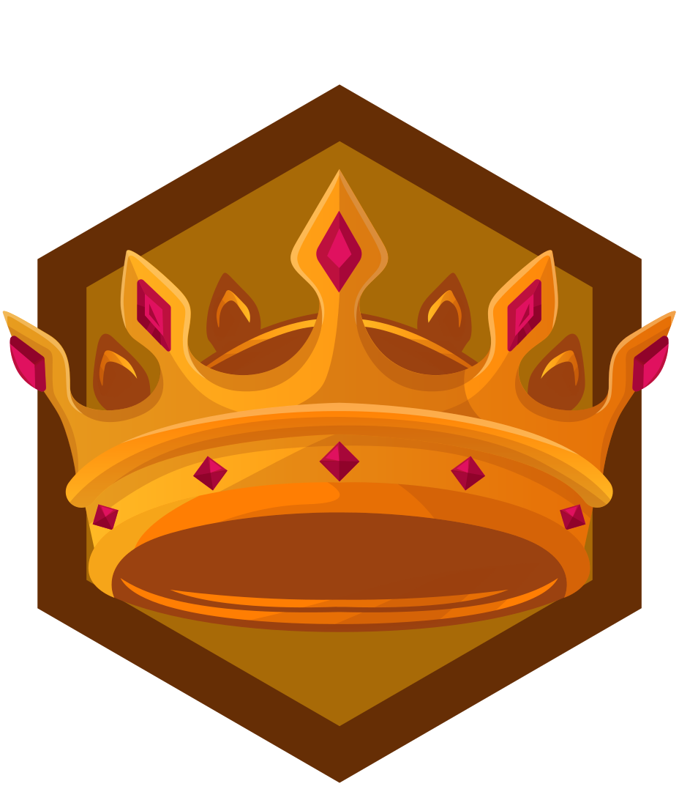
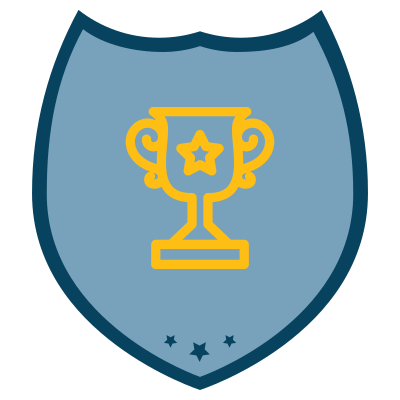
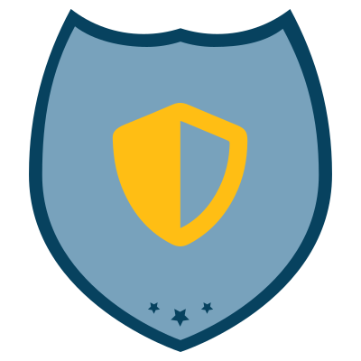
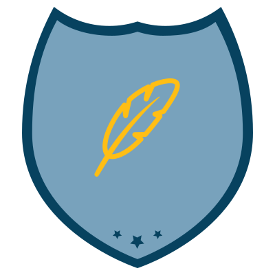
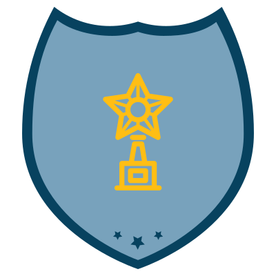
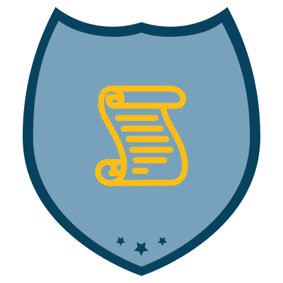

[← Back to PBS Cybersecurity Club](https://pbscybsec.github.io/)
# Badges 
 This is the Achievement Badges of pbscybsec member.
 "Unlock the potential within you. Every challenge you face is an opportunity to grow stronger. Together, we defend the digital world. Stay motivated, keep learning, and let your skills shine in the world of cybersecurity"

## On the basis of club role
<table>
<tr>
<th>S.N</th>
<th>Role</th>
<th>Badges</th>
</tr>
<tr>
<td>1</td> 
<td>President</td>
<td></td>
</tr>
<tr>
<td>2.</td> 
<td>Vice-President</td>
<td></td>
</tr>
<tr>
<td>3</td> 
<td>Treasurer</td>
<td></td>
</tr>
<tr>
<td>4</td>
<td>Secretary</td>
<td></td>
</tr>
<tr>
<td>5</td>
<td>Event Coordinator</td>
<td></td>
</tr>
<tr>
<td>6</td>
<td>Public Relation</td>
<td></td>
</tr>
<tr>
<td>7</td>
<td>Member</td> 
<td></td>
</tr>
</table>

## On the basis of impression point

<table>
<tr>
<th>S.N</th>
<th>Level Name</th>
<th>Point required</th>
<th>Comments</th>
<th>Badges</th>
</tr>
<tr>
<td>1</td>
<td>Novice[0x1]</td>
<td>0</td>
<td>Embarking on cybersecurity journey.</td>
<td></td>
</tr>
<tr>
<td>2</td>
<td>Apprentice[0x2]</td>
<td>200</td>
<td>Learning the ropes, showing promise.</td>
<td></td>
</tr>
<tr>
<td>3</td>
<td>Protector[0x3]</td>
<td>500</td>
<td>Developing skills to safeguard digital realms.</td>
<td></td>
</tr>
<tr>
<td>4</td>
<td>Sentinel[0x4]</td>
<td>1000</td>
<td>A vigilant defender against cyber threats.</td>
<td></td>
</tr>
<tr>
<td>5</td>
<td>Defender[0x5]</td>
<td>1,500</td>
<td>Skilled in protecting digital frontiers.</td>
<td></td>
</tr>
<tr>
<td>6</td>
<td>Guardian[0x6]</td>
<td>2,000</td>
<td>Demonstrating advanced cybersecurity prowess</td>
<td></td>
</tr>
<tr>
<td>7</td>
<td>Shield Bearer[0x7]</td>
<td>3,000</td>
<td>Recognized for exceptional defense strategies.</td>
<td></td>
</tr>
<tr>
<td>8</td>
<td>Cyber Seeker: 0x8[Hacker]</td>
<td>4,000</td>
<td>Navigating cyberspace with curiosity and skill.</td>
<td></td>
</tr>
<tr>
<td>9</td>
<td>Cyber Explorer: 0x9[Omni]</td>
<td>8,000</td>
<td> Exploring diverse facets of cybersecurity.</td>
<td></td>
</tr>
<tr>
<td>10</td>
<td>Code Sorcerer: 0xA[Wizard]</td>
<td>12,000</td>
<td>Mastering the art of coding and enchanting security.</td>
<td></td>
</tr>
<tr>
<td>11</td>
<td>Cyber Maestro: 0xB[Master]</td>
<td>15,000</td>
<td>Commanding cybersecurity expertise with finesse.</td>
<td></td>
</tr>
<tr>
<td>12</td>
<td>Infosec Guru: 0xC[Guru]</td>
<td>17,000</td>
<td>Respected for deep knowledge and mentorship.</td>
<td></td>
</tr>
<tr>
<td>13</td>
<td>Cyber Deity: 0xD[God]</td>
<td>20,000</td>
<td>Achieving the pinnacle of cybersecurity mastery, revered as a digital deity.</td>
<td></td>
</tr>
</table>

## Contribution Badges

<table>
<tr>
<th>S.N</th>
<th>Badge Name</th>
<th>For Whom?</th>
<th>Badge</th>
</tr>
<tr>
<td>1</td>
<td>Top Contributor</td>
<td>For the member who have made significant contribution to th club.</td>
<td></td>
</tr>
<tr>
<td>2</td>
<td>Bug Bounty Hunter</td>
<td>For the members who hav identified and reported security vulnerabilities.</td>
<td></td>
</tr>
<tr>
<td>3</td>
<td>Write-up Author</td>
<td>For the member who have written security-related articles or research papers.</td>
<td></td>
</tr>
<tr>
<td>4</td>
<td>CTF Winner</td>
<td>For the member who have excelled in CTF competitions.</td>
<td></td>
</tr>
<tr>
<td>5</td>
<td>Conference Speaker</td>
<td>For the member who have spoken at cybsersecurity conferences.</td>
<td></td>
</tr>
<tr>
<td>6</td>
<td>Published Research</td>
<td>For the members who have published cybersecurity research.</td>
<td></td>
</tr> 
</table>

## If you want to achieve badge hustle it

- Play CTF: <a href="https://pbscybsec.github.io">Let's Play!</a>
- Learning Resources: <a href="https://pbscybsec.github.io/">Let's learn!</a>
- Discussions: <a href="https://pbscybsec.github.io/">Let's discuss with members!</a>
- Solve Problem: <a href="https://hackerrank.com/hackthis-1">Solve Problem gains solving skill</a>
- Blog: <a href="https://pbscybsec.github.io/blog.html">Explore blog!</a>
